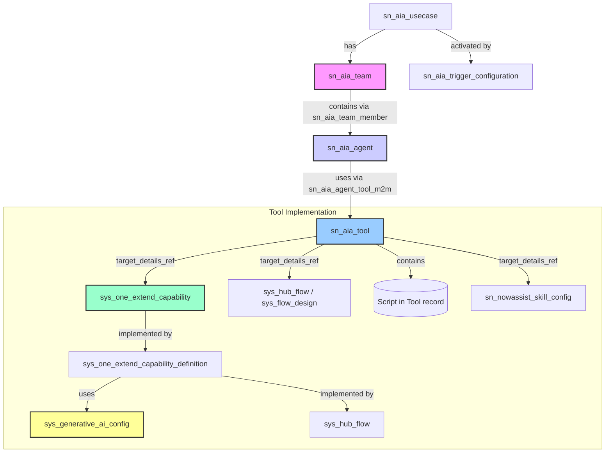

# ServiceNow AI Agent Architecture: Technical Reference

## Executive Summary
ServiceNow's AI Agent architecture enables intelligent automation by orchestrating teams of specialized AI agents that work together to execute complex business processes. This framework combines the reasoning capabilities of Large Language Models with ServiceNow's platform tools, dramatically reducing process cycle times and administrative work while maintaining human oversight at critical decision points. This document provides comprehensive technical and business knowledge to implement, visualize, and optimize AI Agent solutions.


# ServiceNow AI Agent Architecture: Technical Reference

## Introduction

This documentation provides a comprehensive technical reference for understanding, implementing, and optimizing ServiceNow's AI Agent framework. Whether you're building new agentic AI solutions from scratch or enhancing existing workflows with intelligent automation, this guide contains the essential knowledge needed to leverage ServiceNow's powerful AI capabilities.

*Note: This document reflects capabilities based on the ServiceNow [Specify ServiceNow Release Version, e.g., Washington DC] release. Features and table names may vary in other releases.*

### Purpose of This Documentation

This technical reference serves multiple purposes:

1. **Foundational Knowledge**: It establishes a clear understanding of how ServiceNow AI Agents work, their core components, and how they interact within the platform.

2. **Implementation Guide**: It provides detailed technical specifications, including table structures, field definitions, and relationship models that form the backbone of the AI Agent architecture.

3. **Visualization Support**: It enables the creation of business-friendly visualizations that effectively communicate complex AI processes to stakeholders without technical backgrounds.

4. **Translation Layer**: It helps bridge the gap between technical implementation details and business-oriented explanations, allowing you to present AI Agent solutions in terms of business outcomes and value.

### Who Should Use This Guide

This reference is designed for:

- **ServiceNow Developers** building custom AI Agent solutions
- **Solution Architects** designing enterprise automation strategies
- **Technical Consultants** implementing AI-powered workflows
- **Business Analysts** tasked with explaining technical capabilities to stakeholders
- **AI/ML Specialists** integrating advanced intelligence into ServiceNow

### How to Use This Documentation

This guide is structured to support different use cases:

1. **Understanding the Basics**: Start with the conceptual overview sections (1.1-1.3) to grasp fundamental AI Agent concepts
   
2. **Technical Implementation**: Use the database structure and architecture sections (2.1-2.3) when building or modifying agents

3. **Business Value Communication**: Reference the business value sections (6.1-6.2) when preparing executive presentations or business cases

4. **Troubleshooting**: Consult the diagnostic and monitoring sections (section 4 of the Technical Knowledge Base) when resolving issues

The information contained here can be used alongside actual configuration data (like JSON configuration exports, such as the one generated by `background-script-agentic.txt`) to create tailored visualizations and explanations for specific AI Agent implementations across any business domain.

### The Transformative Potential of AI Agents

ServiceNow's AI Agent framework represents a paradigm shift in business process automation. Unlike traditional automation that follows rigid rules, AI Agents combine the reasoning capabilities of Large Language Models with the enterprise context and tools of the Now Platform. This enables truly intelligent automation that can:

- Handle complex, multi-step processes with minimal human intervention
- Make contextual decisions based on available data and business rules
- Coordinate specialized functions through orchestrated agent teams
- Maintain appropriate human oversight at critical decision points

When properly implemented, this architecture can dramatically reduce process cycle times, minimize administrative burden, and allow human workers to focus on higher-value strategic activities.

This documentation provides the knowledge foundation needed to unlock this transformative potential within your organization.

# ServiceNow AI Agent Architecture: Knowledge Base for LLMs

## 1. Basic Concepts and Terminology

### 1.1 AI Agents in ServiceNow

AI Agents represent an advanced automation paradigm within ServiceNow's **Agentic System**. This system combines LLM reasoning capabilities with ServiceNow platform tools to execute complex workflows autonomously. These agents integrate into the existing workforce, leveraging platform capabilities as tools (skills, scripts, flows, etc.) to autonomously perform tasks and analyses while maintaining human oversight, ultimately delivering improved operational speed and cost-effectiveness.

**Agent Profile:** Each agent typically has a profile defining its identity, purpose, operational scope, the LLM provider it uses, and other system settings configured within AI Agent Studio.

**Memory:** Agents utilize memory to maintain context and learn:
*   **Short-Term Memory:** Holds information within a single conversation/session.
*   **Long-Term Memory:** Preserves insights and knowledge across multiple interactions, often stored in dedicated database structures (potentially related to `sn_aia.ltm.*` system properties).
*   **User-Specific Memory:** Retains personalized information related to a specific user to improve future interactions.

### 1.2 AI Agent Types

ServiceNow uses three primary agent types working together:

1. **Orchestrator Agent (Workflow Engine)**:
   - Assigns tasks to agents and coordinates task execution across multiple agents
   - By default, the Orchestrator Agent is part of every AI Agent team
   - Acts as the central component in all agentic workflows and actions
   - Responsible for responding to triggers from use cases within ServiceNow
   - Use cases are defined with triggers and other important metadata so that the Orchestrator Agent can assign tasks to the designated Worker Agent

2. **Worker Agent**:
   - Executes specific tasks based on predefined goals and instructions
   - Configured to use multiple tools such as:
     - Flow actions
     - Retrieval-Augmented Generation (RAG)
     - Scripts
     - Skills
     - Subflows

3. **Collaboration Agent**:
   - Facilitates human-agent collaboration by involving users in workflows when necessary (Human-in-the-loop interactions)

### 1.3 Agent Tools

AI Agents utilize several types of tools, defined in the `sn_aia_tool` table and typically configured via **AI Agent Studio**. Tools represent the actions an agent can perform. Key types include:

1.  **Flow Action / Subflow**:
    *   Predefined sequences of actions built in Flow Designer (`sys_hub_flow` or related tables). These automate specific platform processes.
    *   Example: A subflow for verifying user credentials or updating a record status.

2.  **Skills / Capabilities**:
    *   Custom logic often involving Generative AI, typically built using the Now Assist Skill Kit (NASK) and defined in `sys_one_extend_capability` and related tables. These are a primary way to embed AI reasoning into agent actions.
    *   Example: A skill that routes tickets based on content analysis, or one that generates document content like the "RFX Writer" skill.

3.  **Scripts**:
    *   Custom server-side JavaScript code snippets embedded directly within the `sn_aia_tool` record. Used for unique, complex, or integration tasks not covered by standard actions or skills.
    *   Example: A script that makes a direct REST call to an external system.

4.  **Retrieval-Augmented Generation (RAG) / Search Retrieval**:
    *   Though not explicitly listed as a distinct *tool type* in the script output, RAG is a common *pattern* implemented *within* Skills or potentially Scripts. It allows AI to retrieve and incorporate information (e.g., from Knowledge Bases via AI Search) before generating a response.
    *   The **Search Retrieval** tool type in Agent Studio provides a dedicated way to configure RAG, specifying search profiles and sources.
    *   Agents can also leverage **Group Action Framework (GAF)** clusters as an alternative data source for finding related records if configured.
    *   Example: A skill suggesting relevant knowledge articles by first retrieving them based on the incident description using AI Search or GAF.

5.  **Conversational Topic**:
    *   Links to a Virtual Agent topic to gather information interactively from a user.
    *   Example: An agent uses a VA topic tool to ask the user clarifying questions.

6.  **Catalog Item**:
    *   Allows the agent to interact with Service Catalog items.
    *   Example: An agent helps a user submit a request through a specific catalog item.

7.  **Record Operation**:
    *   Performs standard database operations (Create, Read, Update, Delete) on specified tables.
    *   Example: An agent uses a record operation tool to update an incident record's state.

8.  **Web Search**:
    *   Utilizes configured third-party search APIs (like Bing or Google) to find external information.
    *   Example: An agent searches the web for documentation related to a specific error code.

The specific tools available are configured per agent via the `sn_aia_agent_tool_m2m` mapping table.

### 1.4 Use Cases as Organizational Framework

In ServiceNow's AI Agent architecture, **Use Cases** serve as the primary organizational containers that encapsulate complete business processes. They provide the structural framework that connects all components of the AI Agent ecosystem.

#### 1.4.1 Use Case Definition and Structure

A Use Case in ServiceNow represents a complete, end-to-end business process that can be automated through AI Agent orchestration. Each use case:

- **Defines a business objective**: Such as "RFx Request Intake" or "Vendor Evaluation"
- **Contains a team of agents**: Including one Orchestrator Agent and multiple specialized Worker Agents
- **Specifies activation mechanisms**: Through one or more trigger configurations
- **Establishes boundaries**: Defining the scope and constraints of the automation
- **Maps to measurable outcomes**: With specific KPIs and success metrics

The `sn_aia_usecase` table stores these definitions, linking them to agent teams and triggers.

#### 1.4.2 Relationship to Other Components

Use Cases form the top level of a hierarchical structure:

1. **Use Case → Agent Team**: Each use case is associated with one agent team (`sn_aia_team`), which contains the collection of agents that work together to fulfill the use case's objective. The link between team and agent is stored in `sn_aia_team_member`.

2. **Use Case → Triggers**: Each use case links to one or more trigger configurations (`sn_aia_trigger_configuration`) that determine when and how the use case activates.

3. **Agent Team → Agents**: The agent team contains multiple specialized agents, including one Orchestrator Agent that coordinates the workflow and multiple Worker Agents that handle specific tasks.

4. **Agent → Tools**: Each agent is configured with specific tools via the `sn_aia_agent_tool_m2m` table, determining what actions it can perform.

5. **Tools → Implementations**: Tools reference their implementation details, which may be flows, scripts, skills, or other capabilities.

#### 1.4.3 Use Case Execution Flow

When a use case executes:

1. A **trigger** activates the use case based on its configured conditions
2. The **Orchestrator Agent** initializes with the use case's context and objective
3. The Orchestrator plans the workflow and delegates tasks to appropriate **Worker Agents**
4. Each Worker Agent utilizes its assigned **tools** to perform specific tasks
5. Results flow back to the Orchestrator, which may delegate additional tasks or finalize the process
6. The use case concludes when its objective is met or a terminal state is reached

#### 1.4.4 Use Case Isolation and Reusability

Use cases operate as isolated execution environments, allowing for:

- **Independent configuration**: Each use case can have unique settings and parameters
- **Separation of concerns**: Different business processes can be managed separately
- **Controlled interactions**: Use cases can be designed to hand off to each other at specific points
- **Reusable components**: Agents and tools can be shared across use cases where appropriate

#### 1.4.5 Example: RFx Process Use Cases

A complete RFx management solution might comprise multiple connected use cases:

| Use Case | Business Process | Key Agents | Trigger |
|----------|------------------|------------|---------|
| Request Intake | Collect and validate RFx requirements | Requirements Collector, Validator, Approval Coordinator | New RFx request creation |
| Document Creation | Generate complete RFx documents | Data Retriever, Document Creator, Record Updater | RFx request approval |
| Vendor Q&A | Manage vendor questions and responses | Question Processor, Response Generator | New vendor question submission |
| Proposal Evaluation | Analyze vendor submissions | Submission Intake, Evaluator, Scoring Coordinator | Vendor proposal submission |
| Vendor Selection | Compare finalists and make recommendations | Comparison Agent, Decision Support, Award Communication | Evaluation completion |

Each of these use cases has a distinct business objective but works together to form the complete RFx management lifecycle. This modular approach allows for targeted development, testing, and deployment of specific business capabilities while maintaining overall process integrity.

*Note: ServiceNow also provides various pre-built use cases for common workflows across ITSM, CSM, HRSD, and the Platform, which can be activated or cloned as starting points.* 

Understanding use cases as the foundational organizational framework is essential for effective AI Agent implementation in ServiceNow. All configuration, development, and optimization activities should be approached with this hierarchical structure in mind.

## 2. AI Agent Architecture and Capabilities


### 2.1 Core Architecture

AI agents are software programs that autonomously perform tasks, perceive their environment, and learn from data. They use algorithms like machine learning, deep learning, and reinforcement learning to analyze inputs and make decisions. AI agents can specialize in specific domains like customer service or broadly adapt to various tasks, from personal assistants to autonomous vehicles. They constantly improve their performance by optimizing strategies and learning from experience.

AI agents represent the next phase in automation. They automate workflows and perform role-based activities using platform tools. By leveraging LLMs' reasoning and planning capabilities, AI Agents determine when and how to delegate work, enabling seamless Human + AI collaboration. This accelerates operations, increases productivity, and enhances customer and employee interactions.

Architecture Diagram


```
┌───────────────────────────────────────────────────────────────────┐
│                        USE CASE (e.g., RFx Management)            │
├───────────────────────────────────────────────────────────────────┤
│ ┌─────────────────────────────────────────────────┐               │
│ │                  BUSINESS PROCESS               │               │
│ └───────────────┬─────────────────┬───────────────┘               │
│                 │                 │                               │
│     ┌───────────▼───────────┐     │     ┌─────────────────────┐   │
│     │  TRIGGER ACTIVATION   │     │     │  HUMAN OVERSIGHT    │   │
│     │  - Record changes     │◄────┼────►│  - Approvals        │   │
│     │  - Scheduled events   │     │     │  - Critical decisions│   │
│     │  - Manual invocation  │     │     └─────────────────────┘   │
│     └───────────┬───────────┘     │                               │
│                 │                 │                               │
│     ┌───────────▼───────────┐     │                               │
│     │  ORCHESTRATOR AGENT   │     │                               │
│     │  Plans & coordinates  │     │                               │
│     └─┬─────────┬─────────┬─┘     │                               │
│       │         │         │       │                               │
│ ┌─────▼───┐ ┌───▼─────┐ ┌─▼─────┐ │   ┌───────────┐               │
│ │ WORKER  │ │ WORKER  │ │WORKER │ │   │  TOOLS    │               │
│ │ AGENT 1 │ │ AGENT 2 │ │AGENT 3│ │   │ - Flows   │               │
│ └────┬────┘ └────┬────┘ └───┬───┘ │   │ - Scripts │               │
│      │           │          │     │   │ - Skills  │               │
│      └────────┬──┴──────────┘     │   │ - RAG     │               │
│               │                   │   └───────────┘               │
│     ┌─────────▼───────────┐       │                               │
│     │  RESULTS & ACTIONS  │       │                               │
│     │  - Record updates   │       │                               │
│     │  - Communications   │       │                               │
│     └───────────┬─────────┘       │                               │
│                 ▼                 ▼                               │
│ ┌─────────────────────────────────────────────────┐               │
│ │               BUSINESS OUTCOMES                 │               │
│ └─────────────────────────────────────────────────┘               │
└───────────────────────────────────────────────────────────────────┘
```


### 2.2 Business Process Transformation

The Now Platform automates routine tasks using unstructured data through its integrated tools for ticket handling, workflow management, reporting, and IT service management. By incorporating LLM capabilities and AI Agents, ServiceNow reduces time spent on low-value tasks.

AI enhances decision-making by providing predictive insights, automating data analysis, and offering real-time recommendations. AI Agents improve the handling of complex workflows without requiring predefined decision trees.

AI Agents optimize customer service by providing instant, personalized support, automating routine inquiries, and intelligently routing incoming tickets.

### 2.3 Multi-Agent System Framework

ServiceNow provides a controlled environment for deploying AI Agents, similar to how autonomous driving is first implemented in structured settings. AI Agents interact with humans, data, and workflows, enabling effective automation.

Transforming ServiceNow Concepts with AI Agents:
- Workflows: AI Agents execute workflows and sub-processes
- Organizational Roles: AI Agents operate in multi-agent teams, assuming specialized roles per use case
- Collaboration: Multi-agent orchestration enables coordinated task distribution
- Automation: AI Agents use platform tools such as scripts and workflows

Example: AI-Powered Incident Troubleshooting
1. An Incident record change triggers (`sn_aia_trigger_configuration`) a Use Case (`sn_aia_usecase`).
2. The Orchestrator agent for that Use Case's Team (`sn_aia_team`) plans the task.
3. It might delegate to a 'Diagnosis' Worker Agent (`sn_aia_agent`).
4. The Worker Agent uses a 'Knowledge Search' Tool (`sn_aia_tool`, likely type 'capability' implementing RAG) to find similar past incidents.
5. The Worker Agent uses another 'Solution Proposer' Tool (perhaps another 'capability' skill) to suggest solutions based on retrieved data.
6. The Orchestrator might use a 'Communication' Tool to present the solution or invoke a 'Remediation' Tool (perhaps a 'subflow' type) to initiate an automated plan.

### 2.4 Key Management Components

Several components are central to managing and interacting with the AI Agent ecosystem:

1.  **Generative AI Controller:** This acts as a central hub for customizing the GenAI experience on the Now Platform. It manages connections to LLM providers (NowLLM and BYOLLM), enforces policies like rate limiting and sensitive data handling, and routes requests appropriately. It's a key component for governance and operational control.
2.  **Now Assist Admin Console:** The primary interface for administrators to install Now Assist product plugins, activate/deactivate and configure specific skills, manage user access to features, and monitor usage and performance analytics.
3.  **AI Agent Studio:** As previously mentioned, this is the dedicated IDE for designing, building, configuring, testing, deploying, and monitoring AI Agents, Use Cases, and their associated tools and prompts.
4.  **Now Assist Panel / Context Menu:** These are the primary user-facing interfaces within ServiceNow workspaces or Core UI where end-users interact with enabled Now Assist skills or agents (e.g., triggering summarization, getting help, generating content).

Understanding the roles of these components is crucial for both implementing and managing AI Agent solutions effectively.

## 3. Implementation Architecture

### 3.1 Use Case Design and Structure

Each AI Agent use case consists of:
1. **Trigger & UX**: Define how the skill shall be triggered and integrated into the user experience.
2. **Example**: A skill to be used as integrate human feedback (Human-in-the-Loop) in a synchronous way via the Now Assist Panel or a workflow driven automation.
3. **Pre/Post-Processing**: Sanitizing input data by e.g. tokenization or cleaning input data of unwanted characters.
4. **Prompt Engineering**: Definition of the prompt and instructions for the selected LLM.
5. **Context Management**: Skill Tools (i.e. retrievers, scripts, flows) to retrieve data required to ground the LLM's reasoning.

### 3.2 Trigger Types

There are several ways to trigger a skill within ServiceNow - each comes with their own considerations and appropriate times to use them.

**Trigger Context:**
- **Synchronous / Human in the Loop (supervised)**: Requires real-time human oversight to ensure the output meets expectations and actions are verified before proceeding.
- **Asynchronous / Human in the Loop (supervised)**: Triggered automatically but may require human validation or approval for certain actions or outputs.
- **Asynchronous Human / AI (unsupervised)**: Runs autonomously, with minimal human intervention, and can involve AI for decision-making without the need for manual oversight.

**Trigger Mechanisms:**

1. **Now Assist Panel**: 
   - If the skill is configured to allow a trigger from the Now Assist Panel, the skill may be triggered by the Now Assist Panel by a user.
   - Deploying skills to the Now Assist Panel makes them available to users operating within the Core UI of ServiceNow, allowing text prompt interaction.
   - Use when: **Synchronous Human in the loop (supervised)**

2. **UI Action**:
   - The skill is configured to populate a value within a form such as a change request when triggered.
   - Enables users to trigger prompts via UI actions that will perform an action in an asynchronous way.
   - Use when: **Asynchronous Human in the loop (supervised)**

3. **Business Rule or Script / Platform Event**:
   - Triggers the agent use case based on specific table events (insert, update) matching conditions defined in `sn_aia_trigger_configuration`.
   - This is the primary mechanism observed in the RFx example for initiating agent workflows based on record changes.
   - Use when: **Asynchronous, event-driven automation (supervised or unsupervised)**.

### 3.3 Agents and Tools Integration

Connecting AI Agents to External Systems:
- **Direct REST Calls**: You can have an AI agent trigger a REST message using a script. For instance, if an agent needs to get current currency exchange rates or supplier info from an external service.
- **Now Assist Skill Kit (Custom Skills)**: "Now Assist Skill Kit allows you to build and deploy custom skills that leverage generative AI". These skills can encapsulate integration logic. For example, build a skill called "GetSupplierDetails" that calls an external sourcing application's API (via REST).
- **Platform Flows as Tools**: Another pattern is to treat a Flow or sub-flow as an agent's tool. You might create a Flow that, say, creates records in a third-party system via their API (perhaps using an IntegrationHub spoke). Then have the AI agent trigger that flow.

### 3.4 Performance Optimization

AI Agent Complexity and Orchestration Limits:
- Keep the number of agents in a team reasonable – think of a small team (maybe 3-5 specialized agents) rather than an army of 20
- The orchestrator has a default limit of 3 continuous outputs to a user
- This implies it won't iterate endlessly. Design your agent's plan to conclude within those turns
- Loop prevention: The orchestrator likely avoids infinite loops by design, but be cautious with agents that could trigger each other
- Parallel vs Sequential: Currently, AI Agent Orchestrator in ServiceNow operates largely sequentially (one agent reasoning at a time under the orchestrator's plan)

Token Usage Optimization:
- Tokens (the units of text sent to/received from the LLM) directly affect performance and cost
- Optimize prompts: Be concise in role definitions and instructions
- Limit output length: If an agent's output doesn't need to be long, explicitly tell it to be brief
- Configure retrieval size: Skills like AI Search retrieval (or the dedicated Search Retrieval tool) often allow a limit on how much text to bring back.
- Model choice: If ServiceNow allows choosing a model (e.g., via GenAI Config or Skill Kit), you could choose a faster vs more powerful model for less critical tasks.

### 3.5 Writing Effective Agent/Use Case Instructions

The documentation highlights several guidelines for writing instructions (prompts) for agents and use cases:

*   **Be Concise, Clear, and Precise**: Use simple language to avoid ambiguity.
*   **Limit Technical Jargon**: Improve accessibility and universal applicability.
*   **Include Examples**: Help the agent understand expected behavior and output formats (Few-shot prompting).
*   **Focus on Outcomes**: Clearly state the desired end result for the agent or use case.
*   **Define Roles Clearly (Agents)**: Specify the agent's persona, scope, key tasks, inputs, and outputs.
*   **Structure Sequentially (Use Cases)**: Outline steps logically, including starting conditions, actions, decision points, and end states.
*   **Add Contingencies**: Account for potential errors or unexpected scenarios.

## 4. Skill Design and Implementation

### 4.1 Now Assist Skill Kit

Custom skills in ServiceNow are built using the **Now Assist Skill Kit (NASK)**, enabling deployment of generative AI capabilities directly within a ServiceNow instance. As mentioned before, skills can be leveraged as tools by AI Agents within the ServiceNow platform.

**Required Role**: `sn_skill_builder.admin`
**Licensing Requirements**: 
- Active license for a Now Assist product (e.g., Now Assist for ITSM or HRSD)
- Instance updated to at least the Xanadu release
- All Now Assist plugins updated to the latest versions

**When to Use Custom Skills (vs. OOTB Now Assist Skills):**
Custom skill development using NASK should be considered when:
- Specific industry or organizational requirements cannot be met by OOTB skills.
- Unique workflows or data processing needs exist.
- Integration with proprietary systems or datasets is required.
- Existing OOTB skills cannot be sufficiently configured to meet business objectives.
*Before building custom skills, thoroughly evaluate OOTB capabilities and configuration options.*

### 4.1.1 Pre/Post Processing for Skills

Pre-processors and post-processors in NASK are scripting capabilities (JavaScript functions) that allow data manipulation before sending prompts to AI (pre-processing) and after receiving AI responses (post-processing). This is crucial for handling data complexity and ensuring proper integration.

**Pre-Processing:**
- Sanitizes, formats, and structures data *before* it reaches the AI model.
- Ensures standardized input handling.
- **Example Use Cases**: Formatting data types, removing special characters, data masking/PII protection (e.g., removing SSNs via RegEx).

**Post-Processing:**
- Manages the AI model's response by parsing and transforming the raw output.
- Handles data mapping to ServiceNow fields and error conditions.
- **Example Use Cases**: Handling errors before display, generating fallback responses, formatting output, data masking/PII protection (e.g., removing SSNs from LLM output).

### 4.2 Prompt Engineering

Prompt engineering is crucial for AI development as it directly influences the quality and relevance of the AI's responses, ensuring that the system meets user expectations and requirements. When parameters or integrations such as tools, temperature, or the model itself change, prompts must be adjusted to maintain alignment with the new configurations, optimizing performance and accuracy.

Common prompting techniques:

1. **Zero-shot Prompting**:
   - Providing the AI with a task without examples, relying on pretrained knowledge.
   - **When to use**: For straightforward tasks where the model has inherent understanding. Typically not sufficient on its own for complex agentic workflows.

2. **Few-shot Prompting**:
   - Including examples in the prompt to guide the AI's response.
   - **When to use**: For tasks requiring specific context, reasoning, and/or formatting. Also typically not sufficient on its own for complex agentic workflows.

3. **Chain-of-Thought Prompting (CoT)**:
   - Encouraging step-by-step problem solving.
   - **When to use**: For tasks requiring logical reasoning or multiple steps in sequence. Often used for planning within a larger prompt loop or agentic application.

4. **Contextual Prompting**:
   - Setting the stage with background information before giving any instruction.
   - **When to use**: For tasks requiring specific context understanding. The backbone of Retrieval Augmented Generation (RAG), where context is dynamically retrieved. Often abstracted as a tool for the agent.

5. **Reasoning and Acting (ReAct)**:
   - Combines step-by-step reasoning with actionable steps.
   - Allows AI to think through and execute complex tasks by alternating between thought processes and specific actions.
   - **When to use**: Ideal for tasks requiring analytical thinking and information gathering/tool use. Typically the "system prompt" or backbone logic for agents.

### 4.3 Context Management

Effective context management in Now Assist Skill Kit revolves around two primary components:

- **Skill Inputs**: Provide the static data and parameters necessary for the skill to function (e.g., fields from a record, strings). These inputs define the foundational elements required for processing but do not dynamically adjust based on runtime context during the skill execution itself.
    - **Best Practice**: Pass inputs using data pills rather than scripted fields where possible; validate/clean inputs (potentially using pre-processors).

- **Skill Tools**: Retrieve, process, and integrate *dynamic* data into the generative AI workflow during execution (e.g., using Retrievers for RAG, running scripts, calling flows/subflows). These tools allow the skill to adapt and gather necessary information based on the current situation.

### 4.4 Monitoring and Troubleshooting (Formerly Execution Logs and Monitoring)

Monitoring AI agent execution is crucial for troubleshooting and optimization. While a dedicated `sn_aia_execution_log` table was *not* identified in the examined script/application, monitoring typically involves:

1.  **Flow Designer Execution Details**:
    *   If agents use tools implemented as Flows or Subflows (`sys_hub_flow`), their execution details, inputs, outputs, and logs can be viewed in the Flow Execution details within Flow Designer or the context execution tracker. This is often the primary source for debugging tool logic.

2.  **AI Agent Studio Analytics & Testing**:
    *   The **AI Agent Analytics dashboard** (accessible via Agent Studio) provides high-level metrics on agent/use case usage, executions, and potentially efficiency gains.
    *   The **Testing interface** within Agent Studio allows simulating use case or agent execution, showing the conversation flow, orchestrator logic (execution plan), and detailed decision logs for debugging.

2.  **System Logs (`syslog`)**:
    *   The Now Platform's system logs may contain entries related to AI Agent framework operations, script tool execution (`gs.info`, `gs.warn`, `gs.error` within tool scripts), capability execution, or underlying errors.

3.  **Application-Specific Logging**:
    *   Custom applications built using the AI Agent framework (like the RFx example) might implement their own logging mechanisms, potentially writing to custom log tables or adding specific markers to `syslog`.

4.  **Skill Usage Metrics** (`sn_skill_metrics` - If Applicable):
    *   If using Now Assist skills extensively, this table (or related analytics) might track invocation frequency and performance, helping identify bottlenecks.

5.  **Dedicated Execution Tables** (as listed in documentation):
    *   `sn_aia_execution_plan`: Tracks the overall plan generated by the orchestrator for a use case execution.
    *   `sn_aia_execution_task`: Details individual tasks within an execution plan assigned to specific agents.
    *   `sn_aia_tools_execution`: Logs the execution specifics of individual tools used by agents.
    *   `sn_aia_message`: Records messages exchanged during the agent execution, potentially including user interactions or inter-agent communication.
    *   `sn_aia_agent_config`: May store agent proficiency or configuration snapshots used during execution.

Diagnosing issues often requires correlating information across these different sources based on timestamps and execution context (like the triggering record sys_id).

### 4.5 LLM Provider Selection

ServiceNow offers flexibility in LLM selection through NASK and the broader GenAI configuration (`sys_generative_ai_config`), connecting to NowLLM or external providers (Azure OpenAI, Google Gemini, etc.).

**ServiceNow NowLLM:**
- A domain-specific LLM system optimized for enterprise workflows within ServiceNow (summarization, analysis, generation, automation).
- Fine-tuned for ServiceNow context, often providing lower latency and cost benefits for platform tasks.
- Designed with data privacy focus; customer data is not used for training without explicit opt-in.

**Key Selection Criteria (NowLLM vs. External):**

1.  **Data Privacy Requirements**:
    *   Choose NowLLM if data must remain strictly within the ServiceNow environment.
    *   Use Sensitive Data Handling capabilities (pre/post-processors, plugins) regardless of provider.
    *   Consider external providers only if data sharing policies permit.
2.  **Capability Requirements**:
    *   NowLLM is optimized for ServiceNow tasks.
    *   Consider external models for:
        *   **Specialized Strength**: If an external model excels in a specific area needed (check benchmarks like Chatbot Arena).
        *   **Context Window Size**: NowLLM's context window (input prompt + tool info + history + output) is typically around 8k tokens. External models offer various sizes (e.g., 512 to 2M tokens). Ensure the chosen model's window fits the use case complexity.
        *   **Token Costs**: Costs vary significantly between models and providers. Factor this into the choice.
        *   **API Rate Limits (Tokens/Minute & Calls/Minute)**: External providers have limits. Ensure the expected peak load of the agent/skill fits within the provider's configured quotas to prevent outages.
3.  **Technical Considerations**:
    *   NASK allows connection to any LLM via configuration or spokes.
    *   Pre/post-processors are crucial for formatting data for any chosen LLM.

**Best Practices:**
- Start with NowLLM for standard ServiceNow operations.
- Use external providers for specific, required capabilities not met by NowLLM.
- Align task complexity with model capability (simpler models for simpler tasks = cost savings).
- Always ensure the choice aligns with security and compliance requirements.

### 4.6 Prompt Lifecycle and Governance

A robust Prompt Governance Framework ensures prompts are designed, tested, and maintained effectively, adhering to organizational priorities like response quality, security, privacy, and adaptability.

**Key Objectives:**
- **Performance**: Consistent, accurate, relevant outputs.
- **Reusability**: Clear prompts understandable by stakeholders.
- **Data Security**: Minimize sensitive data exposure; compliance.
- **Privacy Compliance**: Adherence to regulations and policies.
- **Maintainability**: Modular, easy-to-update prompts.

**Prompt Lifecycle:**
1.  **Creation**: Define intent, structure inputs/outputs, design for modularity.
2.  **Evaluation**: Test against diverse scenarios (including edge cases) for security, privacy, relevance, accuracy using defined metrics. Human review and automated checks are essential.
3.  **Deployment**: Only validated, approved prompts move to production.
4.  **Revision**: Any changes require re-evaluation (back to step 2).

**Evaluation Metrics (Examples):**
- **Accuracy**: % of responses meeting expected output criteria.
- **Relevance**: Alignment with user query/task (feedback scores, qualitative review).
- **Security/Privacy**: Instances of sensitive data exposure (target: zero).
- **Clarity**: Understandability for developers/reviewers (audits, surveys).
- **Efficiency**: Token usage per interaction (cost-effectiveness).

**Documentation and Continuous Improvement:**
- Maintain a centralized repository (e.g., Git, ServiceNow tables) for prompts, evaluation history, metrics, version control, and change justifications.
- Implement regular audits, track performance trends, and incorporate feedback loops for iterative refinement.

**Scalability:**
- Utilize tools for version control and testing.
- Establish processes for consistent review across large-scale deployments.
- Design prompts for modularity and adaptability.

### 4.7 Now Assist Data Kit

The Now Assist Data Kit is a configuration and management tool for defining datasets used to **bulk test and evaluate** AI-driven skills developed within NASK. It enables systematic and scalable testing beyond manual, individual scenario checks.

**Key Capabilities:**
- **Dataset Configuration**: Define datasets with inputs (queries, records) and expected outputs or evaluation criteria.
- **Bulk Testing**: Run many predefined test cases simultaneously against a skill.
- **Comparative Analysis**: Track performance trends over time by re-running tests against the same dataset after skill/prompt updates (regression testing).
- **Objective Measurement**: Provides a baseline for evaluating consistency and correctness against known benchmarks (though may lack nuance of human judgment).
- **Integration with Skill Kit**: Complements manual testing in NASK UI; use Data Kit for broader coverage and regression testing after initial manual validation.

**Benefits:**
- Establishes a baseline for consistent, repeatable evaluation.
- Saves time via bulk testing.
- Simplifies regression testing.
- Helps identify performance trends and guide improvements.

*(Setup involves creating Data Sets from tables/columns/filters, grouping them into Data Collections, publishing, and then associating the Collection with a Skill for evaluation within the NASK UI's Evaluations tab.)*

## 5. Configuration Model and JSON Structure

### 5.1 AI Agent Configuration Structure

Based on the configuration file provided, the JSON structure for ServiceNow AI Agents typically includes:

1. **use_cases**: Array of use case definitions
   - sys_id: Unique identifier
   - name: Use case name
   - description: Detailed description of the use case
   - team: Reference to the team of agents
   - agents: Array of agent references
   - triggers: Array of trigger configurations

2. **agents**: Object containing agent definitions
   - sys_id: Unique identifier
   - name: Agent name
   - description: Agent description
   - tools: Array of tool configurations used by the agent

3. **tools**: Object containing tool definitions
   - sys_id: Unique identifier
   - name: Tool name
   - description: Tool description
   - type: Tool type (subflow, capability, etc.)
   - input_schema: Schema for inputs
   - script: JavaScript implementation if applicable

4. **capabilities**: Object containing capability definitions for AI skills
   - sys_id: Unique identifier
   - name: Capability name
   - description: Description
   - type: Usually "skill"
   - genai_config_ref: Reference to GenAI configuration

5. **genai_configs**: Object containing LLM configurations
   - sys_id: Unique identifier
   - name: Configuration name
   - prompt: The prompt template
   - model: LLM model to use
   - temperature: Randomness parameter
   - max_tokens: Output token limit

6. **triggers**: Object containing trigger configurations
   - sys_id: Unique identifier
   - active: Activation status
   - usecase: Reference to use case
   - target_table: Table to monitor
   - condition: Condition for triggering
   - run_as: User context to run under
   - objective_template: Template for agent objective

### 5.2 Business-Friendly Naming Patterns

To make technical implementations business-friendly:

1. **Use Case Names**: Use descriptive business process names like "Request Intake" instead of technical identifiers

2. **Agent Names**: Focus on function rather than technical implementation
   - "Requirements Collector" instead of "RFX Requirements Collector"
   - "Document Generator" instead of "RFX Document Creator"
   - "Vendor Response" instead of "RFX Vendor Question Answerer"

3. **Tool Names**: Describe the business function rather than the implementation
   - "Get Requirements" instead of "Get RFX Request"
   - "Generate Document" instead of "RFX Document Generator"
   - "Update Status" instead of "Update RFX Status"

4. **Trigger Descriptions**: Use plain language descriptions
   - "New Request Created" instead of "rfx_status=new^opened_byISNOTEMPTY^runrfx=true^EQ"

### 5.3 System Properties

Key system properties related to the AI Agent framework (often prefixed with `sn_aia.*`):

*   `sn_aia.orchestrator.default_llm_config`: Specifies the default LLM configuration (`sys_generative_ai_config` sys_id) used by the orchestrator if not overridden elsewhere.
*   `sn_aia.tool.execution.timeout_seconds`: Timeout duration for tool executions.
*   `sn_aia.agent.max_continuous_outputs`: Maximum number of consecutive turns an agent (especially the orchestrator) can respond without explicit user input (helps prevent loops). Default often around 3.
*   `sn_aia.logging.level`: Controls the verbosity of AI Agent framework logs (e.g., 'info', 'debug').
*   `sn_aia.guardian.enabled`: Enables/disables Now Assist Guardian features for monitoring AI interactions.
*   *(Additional properties may exist for specific features like RAG limits, specific tool behaviors, etc.)*

### 5.4 User Roles

Standard roles associated with AI Agents and Skill Kit:

*   **`sn_aia.admin`**: Full administrative access to AI Agent configurations (Use Cases, Agents, Teams, Tools, Triggers). Can create, modify, and delete components.
*   **`sn_aia.viewer`**: Read-only access to AI Agent configurations. Can view definitions but not modify them.
*   **`sn_skill_builder.admin`**: Required to create and manage custom skills using the Now Assist Skill Kit (NASK).
*   *(Standard platform roles like `admin`, `itil`, etc., may grant implicit access or be required to *trigger* use cases depending on configuration).*

### 5.5 Security & Governance

Key aspects include:

*   **Now Assist Guardian**: Monitors AI inputs and outputs for potential risks (toxicity, PII, harmful content) and can block or mask problematic content based on configured policies.
*   **User Impersonation & Run As**: Triggers (`sn_aia_trigger_configuration`) define the user context (`run_as`) under which the agent process executes, ensuring actions respect that user's permissions. Agent Studio testing also allows impersonation.
*   **Domain Separation**: If used, AI Agent configurations and executions generally respect domain separation rules, isolating data and processes between domains. Ensure configurations are placed in the correct domain.
*   **Sensitive Data Handling**: Utilize pre/post-processors in skills or dedicated platform tools/plugins to mask or anonymize sensitive data before sending it to LLMs or displaying results.
*   **Access Controls (ACLs)**: Standard ServiceNow ACLs control access to the underlying AI Agent tables (`sn_aia_*`) and related records (skills, flows, etc.), governed by the roles defined above.

## 6. Business Value and Process Transformation

### 6.1 Key Benefits of AI Agents (Value Propositions)

The value of agentic workflows across organizations stems from several key propositions:

1.  **Increased Productivity / Time Savings**: Automating complex tasks and workflows frees up human agents for higher-value activities.
2.  **Cost Reduction**: Achieved by automating processes, reducing manual labor, optimizing resource use (e.g., computational efficiency), and potentially improving investment longevity through adaptable agents.
3.  **Improved Accuracy / Quality Enhancement**: Reducing human error in repetitive tasks, ensuring consistency, and potentially structuring/improving knowledge assets.
4.  **Enhanced Customer/Employee Experience**: Providing faster responses, more consistent service, personalized interactions, and potentially improving job satisfaction by removing mundane tasks.
5.  **Data-Driven Insights**: Analyzing data to uncover patterns, aiding strategic planning and proactive decision-making.
6.  **Scalability**: Handling increased workloads without proportional cost increases.
7.  **Accelerated Innovation**: Freeing up human resources for strategic initiatives.

### 6.2 Value Drivers

These propositions are driven by specific business goals:

1.  **Cost Reduction**: Directly automating processes to lower operational costs.
2.  **Process Acceleration**: Speeding up workflows like incident resolution or request fulfillment.
3.  **Customer/User Experience**: Improving satisfaction through faster, easier interactions or better self-service.
4.  **Revenue Growth**: Enabling efficiency gains or improved service that leads to higher customer retention or value.

### 6.3 Measuring Quality and Success

Evaluating the success and quality of AI Agent implementations requires specific metrics beyond standard KPIs:

*   **Accuracy**: Evaluating output reliability, factual consistency, and minimizing hallucination. Often involves RAG, semantic search, and re-ranking. Metrics might include F1 Score (lexical overlap), Groundedness (alignment with source data, requires human validation or NLI models), and Completeness.
*   **Generalizability**: Assessing the ability to handle diverse inputs (structured/unstructured) and produce relevant responses. Metrics include ROUGE (comparison to reference texts), Response Relevance Score (RRS, human-rated), and Factuality (comparison to source content).
*   **Explainability**: The ability to understand the agent's reasoning. Measured by traceability (e.g., citations for RAG, query transparency for structured data). Metric: Source (binary indication if output derived from cited sources).
*   **Alignment**: Ensuring the response meets user needs and expectations. Metrics: Relevance (alignment of output to prompt), Helpfulness (is output informative and useful, binary score based on other metrics). Requires human validation.
*   **Usability**: Evaluating the user interface and interaction experience. Measured via dashboards, user feedback, and potentially content moderation metrics.
*   **Inference Performance**: Measuring speed and efficiency. Metrics: Time To First Token (TTFT), Time Per Output Token (TPOT), Latency (total response time), Throughput (tokens/sec), Token Counts (Input/Prompt/Output), LLM Request Count, Directness (clarity, relevance, token size).
*   **Maintainability**: Ensuring the solution is adaptable and easy to improve. Measured qualitatively by design (layered approach) and ability to ingest new data or fine-tune models.

These metrics often require human validation alongside automated checks and should be tracked via dashboards (e.g., AI Agent Studio Dashboard, custom dashboards).

### 6.4 Visualization Best Practices

When visualizing AI agent architectures for executives:

1. **Compare Before and After**: Show the traditional process alongside the AI-powered process to highlight improvement

2. **Emphasize Business Outcomes**: Focus on metrics like time reduction, cost savings, and quality improvements

3. **Simplify Technical Concepts**: Replace technical terminology with business-friendly language

4. **Show Process Flow**: Illustrate the sequence of steps and how agents work together

5. **Highlight Human Touchpoints**: Show where humans remain in the loop for oversight and decisions

6. **Use Visual Hierarchy**: Make the orchestrator central to show how it coordinates the work

## 7. Implementation Planning and Strategy

Successfully deploying AI Agents requires careful planning beyond the technical build. Key strategic areas include:

### 7.1 Implementation Lifecycle Stages

A typical implementation follows structured stages:

1.  **Foundation**: Prepare the Now Platform, configure integrations (LLMs, data sources), set up necessary tools like the Now Assist Data Kit for testing.
2.  **Setup**: Configure AI Agent Studio, establish secure LLM connections (via GenAI Controller), define initial governance settings.
3.  **Development**: Design agents (profiles, prompts, tools, memory), build/configure use cases and triggers, develop custom skills if needed, iterate based on testing.
4.  **Deployment**: Rigorous testing (using Data Kit and specific scenarios), phased rollout (pilot, gradual expansion), user training, performance monitoring.

### 7.2 Use Case Identification & Assessment

Identifying and prioritizing the right use cases is critical:

1.  **Analyze**: Identify potential areas by analyzing existing demand (ticket volumes, repetitive tasks, feedback analysis), looking for high-volume transactions or intelligence gaps (e.g., knowledge management).
2.  **Assess**: Determine if AI Agents are the right solution. Consider agents if the process requires:
    *   Contextual understanding (nuance, ambiguity).
    *   Handling frequent variations/updates.
    *   Scaling expertise.
    *   Complex decision-making based on multiple data points.
    *   *Contrast with:* Simpler tasks might suit basic automation or manual Now Assist skills.
    *   Assess data availability and quality, and perform a basic cost/benefit analysis (human displacement vs. licensing/operational costs).
3.  **Prioritize**: Focus on use cases with high business impact (cost savings, efficiency), feasibility (data readiness, technical complexity - aim for quick wins initially), high adoption potential, and manageable risk/compliance factors. Maintain a prioritized backlog.

### 7.3 Data Readiness Considerations

AI Agents heavily rely on data. Key readiness steps include:

*   **Availability & Inventory**: Audit operational/transactional/historical data. Validate sources. Map the data landscape.
*   **Quality & Completeness**: Profile data (missing values, duplicates), establish stewardship, use validation rules, potentially augment data.
*   **Transformation**: Standardize formats/terminology, normalize fields, potentially apply taxonomies. Structure data appropriately for AI consumption (handling structured vs. unstructured).
*   **Processing & Retrieval**: Optimize pipelines (consider token rate limits for embedding), implement indexing (AI Search), ensure efficient retrieval orchestration.
*   **Security & Privacy**: Implement PII masking/anonymization (using Sensitive Data Handler or custom logic), encryption, and robust access controls.

### 7.4 Organizational Change Management (OCM)

Technical success requires managing the human element:

*   **Preparing for Change**: Define the change clearly, analyze impact on different user groups, develop a communication and training strategy.
*   **Managing Change**: Execute communication plans, provide persona-based training (workshops, hands-on sessions), establish support channels (help desks, champions), monitor progress, track adoption KPIs.
*   **Reinforcing Change**: Measure success against objectives, recognize positive adoption, sustain engagement, capture lessons learned.

### 7.5 Platform Preparation & Prerequisites

Ensure the ServiceNow instance is ready:

*   **Licensing**: Confirm necessary subscriptions (e.g., Now Assist Pro Plus/Enterprise Plus) and sufficient "Assists" (consumption units for LLM calls).
*   **Release Version**: Ensure instance meets minimum version requirements (e.g., Xanadu Patch 3+, Yokohama Patch 1+ depending on specific features like NASK or Agent Studio). Recommended: Stay N-1 from current release.
*   **Plugin Activation**: Activate required Now Assist product plugins (e.g., `sn_nowassist_admin`, `sn_data_kit`, `sn_aia`, `sn_genai_platform`) via the Now Assist Admin Console.
*   **Compatibility Checks**: Validate compatibility of existing customizations or integrations.
*   **Permissions**: Configure user roles and permissions correctly (see Section 5.4).

### 7.6 Rollout Strategy

Deploying agents into production requires careful steps:

*   **Technical Deployment Checks**:
    *   *Access Control*: Use ACLs and potentially beta roles to restrict initial access.
    *   *LLM Performance*: Estimate production load (token counts, calls/min) and ensure provider rate limits (especially for BYOLLM) are sufficient. Monitor performance closely.
    *   *Configuration*: Verify environment-specific settings (endpoints, credentials) are correct. Use prompt templating for flexibility.
    *   *Security*: Final validation of data anonymization, content filtering (Guardian), and compliance settings.
    *   *Monitoring*: Ensure dashboards, logging, and observability tools are configured and functional for production monitoring.
*   **Phased Rollout**: Avoid big-bang deployments.
    *   *Pilot*: Release to a small, controlled group. Monitor performance, gather feedback actively, resolve issues quickly.
    *   *Gradual Expansion*: Incrementally enable for larger groups based on pilot success. Continue monitoring and refining.
    *   *Communication & Support*: Maintain clear communication and support channels throughout the rollout.

## 8. Implementation Example: RFx Process

*Note: The "Source Assist" RFx process described below is one specific example application built using the ServiceNow AI Agent framework. The architectural principles and components discussed throughout this document apply broadly to various business process automation scenarios.*

For most procurement functions, strategic sourcing is a labor intensive process.
- 45+ days average RFx cycle time
- 62% of procurement time spent on administrative tasks
- 42% of RFPs require post issuance clarifications
- 30+ labor hours spent per RFx process

Built on ServiceNow FSC and uses Yokohama's AI agent and Now Assist capabilities, Source Assist reduces administrative burden on procurement teams and reduces cycle times by 70%

Source Assist Use Cases and Agents:

1. **Sourcing Request Intake**: Manages the process for collecting, validating, and approving new strategic sourcing requests.
   - AI Agents: Requirements Collector, Requirements Validator, Sourcing Approval Coordinator

2. **RFx Document Creation**: Creates comprehensive RFx document based on approved strategic sourcing requests.
   - AI Agents: RFX Data Retriever, RFX Document Creator, RFX Record Updater

3. **Vendor Q&A**: Manages vendor questions and generates consistent, fair responses during the competitive bidding process.
   - AI Agents: Vendor Question Processor, Q&A Response Generator

4. **Vendor Evaluation**: Streamlines evaluation of vendor proposals against predefined evaluation criteria.
   - AI Agents: Submission Intake Agent, Submission Evaluation Agent, Scoring Coordinator

5. **Vendor Selection**: Supports decision making for final vendor selection.
   - AI Agents: Vendor Comparison Agent, Decision Support Agent, Award Communication Agent

Value Achieved Using Source Assist:
- 70% reduction in total average RFx cycle time
- 75% reduction in time spent on administrative tasks
- 85% reduction in document errors through AI driven consistency checks
- 65% reduction in total labor hours spent per RFx process

---

This comprehensive overview should provide all the necessary context for an LLM to understand ServiceNow's AI Agent architecture and be able to create business-friendly visualizations for different applications. The key is understanding the relationship between use cases, agents, tools, and triggers, as well as how to translate technical implementation details into business-friendly language.

# ServiceNow AI Agent Architecture: Technical Knowledge Base for LLMs

## 1. Core Database Structure and Tables

### 1.1 Primary AI Agent Tables

ServiceNow's formal AI Agent framework, as observed in the RFx example application, uses these key tables:

1.  **`sn_aia_usecase`**: Stores AI agent use cases.
    *   **Purpose**: Represents a specific business process or goal the AI solution addresses.
    *   **Key Fields**: `sys_id`, `name`, `description`, `team` (Reference to `sn_aia_team`), `active`, `sys_scope`.
    *   **Relationships**:
        *   Contains one Agent Team (`team` field referencing `sn_aia_team`).
        *   Is initiated by one or more Triggers (`sn_aia_trigger_configuration` records point to this table via `usecase` field).

2.  **`sn_aia_agent`**: Stores AI agent definitions (Orchestrator, Worker, potentially Collaboration types).
    *   **Purpose**: Represents an AI worker responsible for specific tasks within a Use Case.
    *   **Key Fields**: `sys_id`, `name`, `description`, `active`, `sys_scope`.
    *   **Relationships**:
        *   Belongs to one or more Agent Teams via `sn_aia_team_member`.
        *   Utilizes one or more Tools via `sn_aia_agent_tool_m2m`.

3.  **`sn_aia_tool`**: Stores tools available to AI agents, defining their capabilities.
    *   **Purpose**: Represents a specific capability or action an Agent can perform. Acts as an interface to an underlying technical component (Skill, Capability, Flow, Script).
    *   **Key Fields**: `sys_id`, `name`, `description`, `active`, `type` ('script', 'capability', 'subflow', 'skill_config', potentially others), `target_document` (reference sys_id to implementation record), `target_document_table` (e.g., 'sys_one_extend_capability', 'sys_flow_design', 'sn_nowassist_skill_config'), `input_schema`, `script` (for type='script').
    *   **Relationships**:
        *   Used by one or more Agents via `sn_aia_agent_tool_m2m`.
        *   Points to one specific Skill, Capability, Flow, or Script record (`target_document` field based on `target_document_table`).

4.  **`sn_aia_team`**: Stores agent teams, grouping agents that work together on a use case.
    *   **Purpose**: Groups Agents that collaborate on a specific Use Case.
    *   **Key Fields**: `sys_id`, `name`, `description`, `active`, `sys_scope`.
    *   **Relationships**:
        *   Referenced by one or more Use Cases (`sn_aia_usecase.team` field).
        *   Contains one or more Agents via `sn_aia_team_member`.

5.  **`sn_aia_trigger_configuration`**: Stores trigger configurations that activate use cases based on platform events.
    *   **Purpose**: Defines the event or condition that initiates a Use Case.
    *   **Key Fields**: `sys_id`, `name`, `active`, `usecase` (Reference to `sn_aia_usecase`), `target_table`, `condition` (Encoded query), `run_as`, `objective_template`.
    *   **Relationships**:
        *   Initiates one Use Case (`usecase` field referencing `sn_aia_usecase`).

6.  **`sn_aia_team_member`**: M2M table linking `sn_aia_team` to `sn_aia_agent`.
    *   **Purpose**: Links Agents to the Team they belong to for a Use Case.
    *   **Key Fields**: `sys_id`, `team` (Reference to `sn_aia_team`), `agent` (Reference to `sn_aia_agent`).
    *   **Relationships**:
        *   Links `sn_aia_team` to `sn_aia_agent`.

7.  **`sn_aia_agent_tool_m2m`**: M2M table linking `sn_aia_agent` to `sn_aia_tool`, also storing agent-specific tool configuration.
    *   **Purpose**: Defines *how* a specific Agent uses a specific Tool, including configuration overrides.
    *   **Key Fields**: `sys_id`, `agent` (Reference to `sn_aia_agent`), `tool` (Reference to `sn_aia_tool`), `inputs` (JSON config), `execution_mode`, `display_output`, `output_transformation_strategy`, `name` (tool name for agent), `description` (tool desc for agent).
    *   **Relationships**:
        *   Links `sn_aia_agent` to `sn_aia_tool`.

### 1.2 Supporting AI Framework Tables

These tables support the implementation of tools, particularly Skills/Capabilities:

1.  **`sys_one_extend_capability`**: Stores custom capabilities/skills, often related to NASK or older frameworks.
    *   **Purpose**: Defines a reusable capability, often a skill, that can be invoked by a Tool.
    *   **Key Fields**: `sys_id`, `name`, `description`, `active`, `type` (e.g., "skill"), `short_description`.
    *   **Relationships**:
        *   Referenced by `sn_aia_tool` (`target_document` field when `target_document_table` is `sys_one_extend_capability`).
        *   Implemented by `sys_one_extend_capability_definition`.
        *   Can be referenced by `sys_generative_ai_config` (`parent` field).

2.  **`sys_one_extend_capability_definition`**: Defines the implementation details for a `sys_one_extend_capability`.
    *   **Purpose**: Specifies how a `sys_one_extend_capability` is implemented (e.g., via a Flow, pre/post processors).
    *   **Key Fields**: `sys_id`, `name`, `description`, `capability` (Reference to `sys_one_extend_capability`), `api` (Reference to implementation, e.g., a Flow sys_id), `api_type` (e.g., 'sys_hub_flow'), `preprocessor`, `postprocessor`.
    *   **Relationships**:
        *   Implements one `sys_one_extend_capability` (`capability` field).
        *   Referenced by `sys_generative_ai_config` (`definition` field).
        *   Points to an implementation API (e.g., `sys_hub_flow`) via `api` field.

3.  **`sys_generative_ai_config`** (or `sys_generative_ai_prompt_config`): Stores LLM prompt configurations.
    *   **Purpose**: Defines a specific prompt, model, and parameters used by a Skill or Capability.
    *   **Key Fields**: `sys_id`, `name`, `active`, `prompt`, `model`, `temperature`, `max_tokens`, `additional_configurations` (JSON), `parent` (Optional reference, e.g., to `sys_one_extend_capability`), `definition` (Reference to `sys_one_extend_capability_definition`), `definition_table`.
    *   **Relationships**:
        *   Linked to one Skill or Capability implementation via `parent`, `definition`, or `additional_configurations` fields.

4.  **`sys_hub_flow`**: Stores Flow Designer flow definitions.
    *   **Purpose**: Defines an automated workflow process.
    *   **Key Fields**: `sys_id`, `name`, `internal_name`, `sys_updated_on`, `sys_updated_by`, `sys_created_on`, `sys_created_by`, `sys_scope`.
    *   **Relationships**:
        *   Can be referenced by `sn_aia_tool` (`target_document` field when `target_document_table` is `sys_flow_design`).
        *   Can be referenced by `sys_one_extend_capability_definition` (`api` field when `api_type` is `sys_hub_flow`).

5.  **`sn_nowassist_skill_config`**: Stores configurations for Now Assist skills (details less known from script context).
    *   **Purpose**: Defines a specific Now Assist Skill configuration (likely newer framework).
    *   **Key Fields**: `sys_id`, `name`, `description`, `active` (Other fields TBD).
    *   **Relationships**:
        *   Can be referenced by `sn_aia_tool` (`target_document` field when `target_document_table` is `sn_nowassist_skill_config`).
        *   Potentially referenced by `sys_generative_ai_config` (`additional_configurations` JSON).

## 2. Relationships and Architecture

### 2.1 Entity Relationship Model

The AI Agent framework follows this relationship model (simplified):



*(Note: The above Mermaid diagram shows key relationships. `target_details_ref` on `sn_aia_tool` points to the specific implementation record based on `target_document` and `target_document_table` fields).*

### 2.2 Technical Architecture Flow

1. **Trigger Activation**:
   - Record changes in monitored tables activate triggers based on conditions
   - The trigger locates the corresponding use case and prepares execution context

2. **Orchestrator Initialization**:
   - The AI Agent framework initializes the Orchestrator agent
   - The Orchestrator receives the objective and context from the trigger

3. **Agent Planning**:
   - Orchestrator analyzes the objective and determines required specialized agents
   - Creates execution plan based on agent capabilities and necessary steps

4. **Task Distribution**:
   - Orchestrator invokes worker agents with specific tasks
   - Each worker agent receives relevant context and objective

5. **Tool Execution**:
   - Worker agents use assigned tools to perform tasks
   - Tools execute via flows, scripts, skills, or retrievers and return results

6. **Result Aggregation**:
   - Worker agents return execution results to Orchestrator
   - Orchestrator consolidates and evaluates results

7. **Human Interaction** (if required):
   - Collaboration agents manage human-in-the-loop touchpoints
   - Human feedback is incorporated into the workflow

8. **Output Generation**:
   - Final results are formatted and delivered to intended target
   - System records are updated with execution outcomes

### 2.3 Technical Implementation Details

1. **Skill Execution Process**:
   - When a skill is invoked as a tool, the system:
     - Retrieves the associated `sys_one_extend_capability`
     - Locates the implementation from `sys_one_extend_capability_definition`
     - Loads the prompt from `sys_generative_ai_prompt_config`
     - Prepares inputs using the capability's preprocessor
     - Calls the LLM with the prepared prompt
     - Processes the LLM response using the capability's postprocessor
     - Returns the processed result to the agent

2. **Agent Tool Configuration** (from `sn_aia_agent_tool_m2m`):
   - `inputs`: Configuration of inputs to pass to the tool (JSON format)
   - `execution_mode`: Mode like "autopilot" or "manual"
   - `display_output`: Whether to display the output to users
   - `output_transformation_strategy`: How to transform tool output (e.g., "paraphrase")
   - `name_in_agent`: Tool name as presented to the agent
   - `description_in_agent`: Tool description for agent context

3. **LLM Provider Integration**:
   - ServiceNow AI Agents can use various LLM providers:
     - Now LLM (ServiceNow's proprietary LLM)
     - Azure OpenAI
     - Google Vertex AI
     - Custom providers via integration
   - Each provider requires specific configuration including endpoint URLs, authentication, and rate limits

4. **Security and Data Handling**:
   - `sensitive_data_handler`: Responsible for identifying and masking sensitive information
   - `gen_ai_controller`: Manages rate limiting and provider selection
   - `now_assist_guardian`: Monitors for potential risks in AI interactions
   - Access controls determine which users can create, modify, and execute AI agents

## 3. Implementation Methods

### 3.1 Creating AI Agents Programmatically

AI Agents and related components can be created programmatically via GlideRecord operations, manipulating the tables listed in Section 1.1:

```javascript
// Example: Create a use case
var useCase = new GlideRecord('sn_aia_usecase');
useCase.initialize();
useCase.setValue('name', 'My Agentic Process');
useCase.setValue('description', 'Handles my business process end-to-end');
useCase.setValue('team', teamSysId); // Reference to sn_aia_team sys_id
var ucSysId = useCase.insert();

// Example: Create an agent
var agent = new GlideRecord('sn_aia_agent');
agent.initialize();
agent.setValue('name', 'My Worker Agent');
agent.setValue('description', 'Specialized worker agent for my process');
// agent.setValue('sys_scope', 'your_scope_sys_id'); // Set appropriate scope
var agentSysId = agent.insert();

// Example: Link Agent to Team
var teamMember = new GlideRecord('sn_aia_team_member');
teamMember.initialize();
teamMember.setValue('team', teamSysId);
teamMember.setValue('agent', agentSysId);
teamMember.insert();

// Example: Associate a tool with an agent
var toolM2M = new GlideRecord('sn_aia_agent_tool_m2m');
toolM2M.initialize();
toolM2M.setValue('agent', agentSysId);
toolM2M.setValue('tool', toolSysId); // Reference to sn_aia_tool sys_id
// Configure tool settings in JSON stored in 'config' or specific fields
var toolConfig = {
    inputs: [], // Define expected inputs if any
    execution_mode: 'autopilot',
    display_output: '1', // Or '0'
    output_transformation_strategy: 'paraphrase', // Or other strategies
    name: 'My Tool For Agent', // Override tool name for this agent
    description: 'This tool performs a specific function for this agent' // Override description
};
// Note: The export script showed specific fields like execution_mode, display_output etc. 
//       Check if there's a single 'config' JSON field or separate fields in your version.
toolM2M.setValue('name', toolConfig.name); 
toolM2M.setValue('description', toolConfig.description);
toolM2M.setValue('execution_mode', toolConfig.execution_mode);
toolM2M.setValue('display_output', toolConfig.display_output);
toolM2M.setValue('output_transformation_strategy', toolConfig.output_transformation_strategy);
toolM2M.setValue('inputs', JSON.stringify(toolConfig.inputs)); // If 'inputs' is a dedicated JSON field
toolM2M.insert();
```

### 3.2 Custom Tool Creation

Creating a custom tool via script:

```javascript
// Create a tool for AI agents
var tool = new GlideRecord('sn_aia_tool');
tool.initialize();
tool.name = 'My Custom Tool';
tool.description = 'Performs a custom operation';
tool.active = true;
tool.type = 'script'; // Can be 'script', 'subflow', 'capability', etc.
tool.input_schema = JSON.stringify([
    {
        name: 'input1',
        label: 'Input 1',
        type: 'string',
        mandatory: true
    }
]);
tool.script = `(function(inputs) {
    // Tool implementation logic here
    try {
        // Process inputs
        var result = doSomething(inputs.input1);
        
        // Return result
        return {
            status: 'success',
            message: 'Operation completed successfully',
            data: result
        };
    } catch (error) {
        return {
            status: 'error',
            message: error.message
        };
    }
})(inputs);`;
tool.insert();
```

### 3.3 Trigger Configuration

Creating a trigger to activate an AI agent:

```javascript
// Create a trigger configuration
var trigger = new GlideRecord('sn_aia_trigger_configuration');
trigger.initialize();
trigger.active = true;
trigger.usecase = useCaseSysId;
trigger.target_table = 'incident'; // Table to monitor
trigger.condition = 'priority=1^state=2'; // Encoded query condition
trigger.run_as = 'system'; // User context
trigger.objective_template = 'Analyze high priority incident ${number}';
trigger.insert();
```

## 4. Diagnostic and Monitoring

### 4.1 Execution Logs and Monitoring

Monitoring AI agent execution is crucial for troubleshooting and optimization. While a dedicated `sn_aia_execution_log` table was *not* identified in the examined script/application, monitoring typically involves:

1.  **Flow Designer Execution Details**:
    *   If agents use tools implemented as Flows or Subflows (`sys_hub_flow`), their execution details, inputs, outputs, and logs can be viewed in the Flow Execution details within Flow Designer or the context execution tracker. This is often the primary source for debugging tool logic.

2.  **AI Agent Studio Analytics & Testing**:
    *   The **AI Agent Analytics dashboard** (accessible via Agent Studio) provides high-level metrics on agent/use case usage, executions, and potentially efficiency gains.
    *   The **Testing interface** within Agent Studio allows simulating use case or agent execution, showing the conversation flow, orchestrator logic (execution plan), and detailed decision logs for debugging.

2.  **System Logs (`syslog`)**:
    *   The Now Platform's system logs may contain entries related to AI Agent framework operations, script tool execution (`gs.info`, `gs.warn`, `gs.error` within tool scripts), capability execution, or underlying errors.

3.  **Application-Specific Logging**:
    *   Custom applications built using the AI Agent framework (like the RFx example) might implement their own logging mechanisms, potentially writing to custom log tables or adding specific markers to `syslog`.

4.  **Skill Usage Metrics** (`sn_skill_metrics` - If Applicable):
    *   If using Now Assist skills extensively, this table (or related analytics) might track invocation frequency and performance, helping identify bottlenecks.

5.  **Dedicated Execution Tables** (as listed in documentation):
    *   `sn_aia_execution_plan`: Tracks the overall plan generated by the orchestrator for a use case execution.
    *   `sn_aia_execution_task`: Details individual tasks within an execution plan assigned to specific agents.
    *   `sn_aia_tools_execution`: Logs the execution specifics of individual tools used by agents.
    *   `sn_aia_message`: Records messages exchanged during the agent execution, potentially including user interactions or inter-agent communication.
    *   `sn_aia_agent_config`: May store agent proficiency or configuration snapshots used during execution.

Diagnosing issues often requires correlating information across these different sources based on timestamps and execution context (like the triggering record sys_id).

### 4.2 Common Troubleshooting Areas

1. **Skill Execution Issues**:
   - Verify that the skill is correctly implemented and that the tool is functioning as expected.
   - Check the skill's execution logs and metrics to identify any bottlenecks or failures.

2. **Trigger Configuration Errors**:
   - Ensure that the trigger conditions are correctly set up and that the use case is being activated as intended.
   - Verify that the trigger is not being triggered too frequently or too infrequently.

3. **Agent Tool Configuration**:
   - Ensure that the tool configuration is correct and that the tool is properly integrated with the agent.
   - Verify that the tool's inputs and outputs are correctly configured and that the tool is returning expected results.

4. **Orchestrator Logic**:
   - Verify that the orchestrator is correctly planning and executing the workflow.
   - Check the orchestrator's execution logs and metrics to identify any bottlenecks or failures.

5. **Human Interaction**:
   - Ensure that the human-in-the-loop touchpoints are correctly configured and that human feedback is being incorporated into the workflow.
   - Verify that the collaboration agents are correctly managing human interactions.

## 5. Advanced Configurations

### 5.1 Advanced LLM Configuration

The `sys_generative_ai_prompt_config` table supports advanced LLM configurations:

```json
{
  "skill_config_id": "unique_identifier",
  "additional_parameters": {
    "top_p": 0.9,
    "presence_penalty": 0.6,
    "frequency_penalty": 0.2,
    "stop_sequences": ["\n\n", "---"]
  },
  "model_specific_settings": {
    "azure_openai": {
      "deployment_id": "custom_deployment"
    }
  }
}
```

These configurations allow fine-tuning of LLM behavior beyond the basic temperature and max_tokens parameters.

### 5.2 Advanced Prompt Engineering Patterns

1. **System Message + User Message Pattern**:
   ```
   <System_Role>
   You are a [role description] specialized in [domain].
   </System_Role>
   
   <Context>
   [Relevant context data for the task]
   </Context>
   
   <Instructions>
   [Specific task instructions]
   
   Format your response as:
   [Expected output format]
   </Instructions>
   ```

2. **ReAct Pattern for Agent Reasoning**:
   ```
   You are a Task Completion Agent with access to tools: [list of tools]
   
   GOAL: [specific goal]
   
   FORMAT YOUR RESPONSE AS:
   Thought: [analyze current situation]
   Action: [select specific tool/action]
   Observation: [record results]
   Reflection: [evaluate results]
   Next Steps: [outline upcoming actions]
   
   CONSTRAINTS: [list any constraints]
   ```

3. **Few-Shot Learning with Examples**:
   ```
   Here are examples of how to [perform task]:
   
   Input: [example input 1]
   Output: [expected output 1]
   
   Input: [example input 2]
   Output: [expected output 2]
   
   Now perform the same task:
   Input: [actual input]
   ```

These patterns can be implemented in the prompt field of the `sys_generative_ai_prompt_config` record to guide agent behavior.

### 5.3 Relevant System Properties

The ServiceNow documentation (`07-create-an-ai-agent.md`) lists several system properties (`sn_aia.*`) that control AI Agent behavior. Understanding these is key for fine-tuning:

*   `sn_aia.agent_llm_provider`: (Default: `azure_openai`) Defines the default LLM provider for agents.
*   `sn_aia.agent_tool_supported_data_types`: Comma-separated list of supported data types for tool inputs/outputs (references `sys_glide_object` names).
*   `sn_aia.analytics_dashboard_sysid`: Sys ID of the AI Agent Analytics dashboard.
*   `sn_aia.continuous_communicator_output_limit`: (Default: 3) Max number of continuous outputs the Orchestrator can show users without intervention.
*   `sn_aia.continuous_tool_execution_limit`: (Default: 7) Max consecutive times the *same* tool can be used in a plan.
*   `sn_aia.enable_usecase_tool_execution_mode_override`: (Default: false) If true, allows running use cases fully autonomously, overriding supervised tool settings.
*   `sn_aia.ltm.category.auto_create`: (Default: false) Controls auto-creation of categories for long-term memory.
*   `sn_aia.ltm.enable_long_term_memory`: (Default: false) Enables long-term memory for agents to recall past interactions.
*   `sn_aia.ltm.use_memory_for_ai_agent`: (Default: false) Enables use of long-term memory *within* agent interactions.
*   `sn_aia.maximum_agent_tools`: (Default: 20) Maximum number of tools assignable to a single AI agent.
*   `sn_aia.max_scheduled_trigger_query`: (Default: 10) Number of records processed per run for scheduled triggers.
*   `sn_aia.mid_skill_switch_enabled`: (Default: false) Controls mid-skill switching capabilities.
*   `sn_aia.react_failure_retry_max_limit`: (Default: 3) Max retries upon execution failure within the ReAct loop.
*   `com.glide.cs.dynamic.capability.timeout`: (Default: 180 seconds) Timeout for generating the AI Agent Proficiency Descriptor.

*(Note: Always verify property names and defaults in your specific ServiceNow version.)*

### 5.4 Security and Governance

*   **Now Assist Guardian**: Integrates with AI Agents to detect and potentially block harmful content (offensiveness, prompt injection) during execution. Configurable via Agent Studio settings.
*   **User Impersonation**: Triggered use cases typically run as a designated user (e.g., 'run_as' field on the trigger, often the user who initiated the action like 'caller' or 'assigned_to'). Tools executed within the Now Assist panel run as the logged-in user. This ensures actions are audited correctly.
*   **Domain Separation**: Basic domain separation is supported at design time (configuring agents/use cases within specific domains) and run time (visibility based on the executing user's domain).

### 5.5 User Roles

Key roles associated with AI Agents:

*   `sn_aia.admin`: Full administrative access. Can create, read, update, and delete AI Agent configurations (use cases, agents, tools, triggers).
*   `sn_aia.viewer`: Read-only access. Can view configurations and analytics dashboards.
*   Standard platform roles (`admin`, potentially application-specific admin roles) are needed for related configurations like creating underlying Flows, Scripts, or Capabilities.
*   Users interacting with agents via the Now Assist panel typically need the `now_assist_panel_user` role.

## 6. Custom Application Implementation

For applications like the Source Assist RFx management solution, you can leverage the AI Agent framework by:

1. **Defining Use Cases**:
   - Map business processes (Intake, Document Creation, Q&A, etc.) to use cases
   - Create appropriate triggers based on record status changes

2. **Creating Specialized Agents**:
   - Define worker agents for specific functions (Requirements Collection, Document Generation)
   - Configure appropriate tools for each agent

3. **Building Integration Tools**:
   - Create tools that connect to your application's data and external systems
   - Implement proper error handling and response formatting

4. **Implementing Human Touchpoints**:
   - Define key decision points requiring human input
   - Configure collaboration agents to manage these interactions

5. **Connecting to Business Value Metrics**:
   - Establish KPIs for measuring agent performance
   - Create dashboards to track business outcomes

This technical architecture knowledge should provide a comprehensive foundation for implementing AI Agent solutions in ServiceNow, regardless of the specific application domain.

## 7. How to Use This Knowledge with LLMs

This knowledge base is specifically designed to enable Large Language Models (LLMs) to understand, explain, and visualize ServiceNow's AI Agent architecture. The following guidelines will help you extract maximum value when using this reference with an LLM.

### 7.1 Effective Prompting Patterns

When asking an LLM to help with ServiceNow AI Agent tasks, structure your prompts using these patterns:

#### For Creating Visualizations:

```
Please create a visualization of the ServiceNow AI Agent architecture for [specific use case]. 
I need to show:
1. The flow between the key use case stages: [list stages]
2. How the orchestrator coordinates the specialized agents
3. The specific agents involved and their roles
4. The tools each agent uses
5. The business value created at each stage

Make it business-friendly by using [business domain] terminology rather than technical names.
```

#### For Technical Implementation Questions:

```
Based on the ServiceNow AI Agent architecture, how would I implement [specific function]?
I specifically need to understand:
1. The tables and fields involved
2. The relationships between components
3. Any configuration considerations
4. Potential limitations or best practices
```

#### For Business Value Explanations:

```
Help me explain to [executive/stakeholder] how ServiceNow AI Agents transform our [business process].
Focus on:
1. The time/cost savings compared to our current process
2. How the AI orchestration works in business terms
3. Where humans remain in the loop for oversight
4. The measurable business outcomes we can expect
```

### 7.2 Providing Configuration Data

When asking an LLM to help with specific implementations, include:

1. **JSON Configuration**: Provide the JSON export of your specific AI Agent configuration (use cases, agents, tools)
2. **Business Context**: Briefly describe the business process you're automating
3. **Current State Metrics**: Include current process statistics (cycle time, labor hours, error rates)

Example prompt with configuration data:

```
Here is my ServiceNow AI Agent configuration for an RFx management process:
[JSON configuration data]

Please help me create a visualization that shows how these components work together to 
automate our procurement process. Our current process takes 45+ days with 62% of time 
spent on administrative tasks.
```

### 7.3 Creating Different Types of Visualizations

Depending on your audience, request different visualization approaches:

1. **Executive Overview**: High-level comparison of current vs. AI-powered process with business metrics
   ```
   Create an executive-friendly visualization showing how our AI-powered RFx process 
   reduces cycle time from 45+ days to 15 days, with minimal technical details.
   ```

2. **Process Flow Diagram**: End-to-end workflow showing each stage, agent, and transition
   ```
   Create a process flow diagram showing how each AI agent contributes to the 
   end-to-end RFx process, from intake to vendor selection.
   ```

3. **Technical Architecture**: Detailed view of components, relationships, and data flow
   ```
   Create a technical architecture diagram showing how the AI Agent components 
   (use cases, agents, tools, triggers) relate to each other in our implementation.
   ```

4. **Interactive Explanation**: Step-by-step breakdown of agent interactions
   ```
   Create an interactive visualization that shows what happens at each step when a 
   new RFx request triggers our AI agent workflow.
   ```

### 7.4 Translating Technical Features to Business Value

Ask the LLM to translate specific technical capabilities into business terms:

```
How would you explain the value of [technical feature, e.g., "orchestrated agent teams"] 
to our [specific stakeholder, e.g., "procurement VP"]? Focus on how this directly 
improves their key metrics around [specific goals, e.g., "vendor selection speed and quality"].
```

### 7.5 Troubleshooting with LLMs

When using LLMs to help diagnose AI Agent issues:

```
We're experiencing [specific issue] with our ServiceNow AI Agent implementation.
The relevant configuration is:
[Configuration details]

The error logs show:
[Error message or log extract]

Based on the ServiceNow AI Agent architecture, what could be causing this issue and 
how might we resolve it?
```

### 7.6 Best Practices for Ongoing Interaction

1. **Iterative Refinement**: Start with a basic visualization request, then refine with specific follow-up prompts
2. **Context Preservation**: Keep the full conversation history with the LLM to maintain context
3. **Concrete Examples**: When the LLM provides abstract explanations, ask for specific examples relevant to your use case
4. **Balanced Perspective**: Ask for both technical details and business value to ensure comprehensive understanding
5. **Verification Prompting**: Ask the LLM to explain its reasoning or sources when providing technical information

By following these guidelines, you can effectively leverage LLMs to translate complex ServiceNow AI Agent implementations into clear, business-friendly explanations and visualizations that drive understanding and adoption across your organization.

## 8. Glossary of Key Terms

| Term | Definition |
|------|------------|
| **AI Agent** | An autonomous software entity that combines LLM reasoning with platform tools to execute specific tasks within a business process. |
| **Orchestrator Agent** | The central coordinating agent that plans, assigns tasks, and manages the overall workflow across specialized worker agents. |
| **Worker Agent** | A specialized agent that executes specific tasks using assigned tools based on instructions from the orchestrator. |
| **Collaboration Agent** | An agent designed to facilitate human-in-the-loop interactions, gathering input and communicating results. |
| **Agent Tool** | A capability assigned to an agent that enables it to perform specific functions, including flows, scripts, skills, or retrievers. |
| **Trigger** | A configuration that defines when and how an AI agent or use case is activated (record-based, scheduled, or manual). |
| **Use Case** | A complete business process implementation using AI agents, including triggers, agent teams, and expected outcomes. |
| **Now Assist Skill Kit (NASK)** | A development framework for creating custom generative AI skills that can be used by AI agents. |
| **Retrieval Augmented Generation (RAG)** | A technique where AI retrieves relevant information from knowledge sources to ground its responses. |
| **LLM (Large Language Model)** | The underlying AI technology that powers agent reasoning, such as Now LLM or external providers. |
| **Now LLM** | ServiceNow's proprietary large language model optimized for enterprise workflows. |
| **Token** | The basic unit of text processing in LLMs, affecting context windows and processing costs. |
| **Prompt Engineering** | The practice of designing effective instructions for LLMs to achieve desired outputs. |
| **ReAct** | A prompting pattern (Reasoning + Acting) that guides agents through thinking and action steps. |
| **Human-in-the-Loop** | A design approach where human oversight and input are incorporated at critical decision points. |
| **Agent Studio** | ServiceNow's primary interface for designing, configuring, managing, testing, and monitoring AI Agents, Use Cases, Tools, and related components. Provides guided setup and analytics. *Availability and specific features may vary by release and product.* |
| **BYOLLM** | "Bring Your Own LLM" approach allowing integration with external language models (like Azure OpenAI, Google Vertex AI) via configuration. |
| **Agentic System** | The overall ServiceNow framework encompassing AI agents, orchestrators, tools, and use cases designed for autonomous task execution. |
| **Base Plan** | The initial set of instructions provided to the orchestrator agent at the use case level to guide planning. |
| **Agent Proficiency** | An LLM-generated description summarizing an agent's capabilities based on its role, instructions, and assigned tools. |
| **Now Assist Guardian** | A platform feature integrated with AI Agents to detect and mitigate risks like offensive content or prompt injection. |
| **Group Action Framework (GAF)** | An alternative mechanism (to AI Search) for agents to find and cluster related records on task tables, usable by specific tools. |